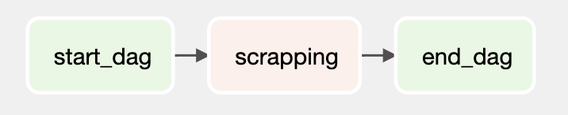
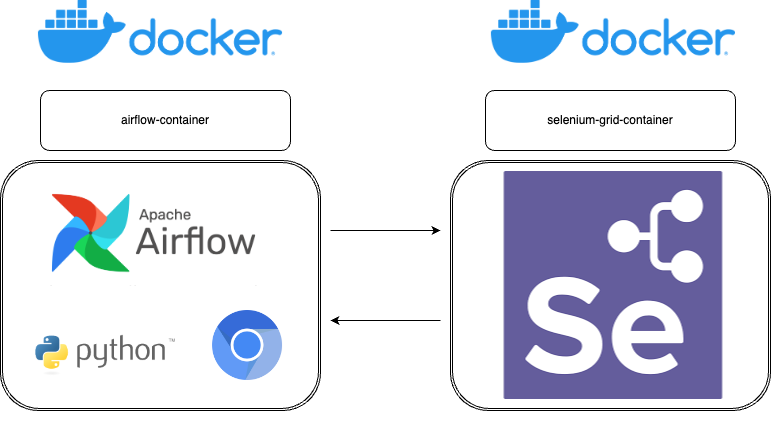
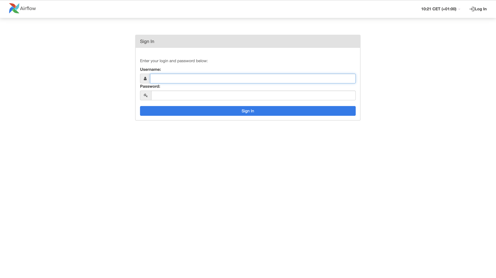
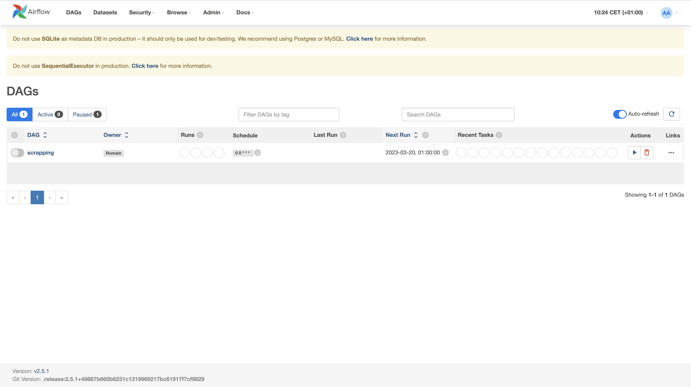

<div>
<h1 align="center"> Airflow Yahoo Finance Scraper </h1>
</div>


## 


## 

## Description

In this project, I implemented an automated Yahoo Finance webscraping script using Selenium, Apache Airflow, Docker and Selenium Grid togheter.

Duration : 9 days

## Tools

- Selenium : Python library for scraping pages containing javascript code

- Apache Airflow : Python library to schedule scripts

- Docker : an application to run other applications in isolated small boxes named containers which are built from an image who is built from a Dockerfile.

- Selenium Grid : a required app who allow,among other things, to run selenium's code in a Docker container

## Project Structure

- Dags folder : define airflow's DAGs (Directed Acyclic Graph) in one file and my scraper's functions in another one. 
  
  An Airflow DAG is a collection of all the tasks you want to run, organized in a way that reflects their relationships and dependencies.
  
  

- Dockerfile : create the environnement where everything will work toegheter.

- requirements.txt : required by the Dockerfile to build the docker's image who will create the docker container in which the script will run.

Here is a picture to show you the project's structure



As you can see in the airflow-container, airflow is managing everything.

To clarify the relation between both containers, the selenium-grid-container is only needed for the scraping part. My python script (who is located in the airflow-container) has as selenium's webdriver, the name of the selenium-grid-container with that structure : [http://selenium-grid-container:4444/wd/hub](http://selenium-grid-container:4444/wd/hub). At the end of the scraping, the selenium-grid-container is not used anymore.

The data cleaning, shapping, csv creating and saving is done in the airflow-container.

## Installation and Usage

1. To launch this project, you'll need to install and run Docker Desktop on your computer. You can find all you need to install it here : [Download Docker Desktop | Docker](https://www.docker.com/products/docker-desktop/)

2. Clone this repo

3. Open the root of the folder in your terminal

4. Build the docker image using Dockerfile to be able to use Airflow with any operating system
   
   ```docker
   docker build -t airflow_image .
   ```

5. Create a connection between containers using docker network
   
   ```
   docker network create scrap
   ```

6. Create the docker container with Airflow and the requirements.txt in it 
   
   ```
   docker run -itd --rm --network scrap --name airflow-container -p 9090:8080 -v $(pwd):/docker_env airflow_image
   ```

7. Create the docker container with Selenium_Grid with Chromium in it. This command will automatically pull the docker's image needed to run the container :
   
   ```docker
   docker run -itd --rm --network scrap --name selenium-grid-container -p 4444:4444 --shm-size 2g seleniarm/standalone-chromium:latest
   ```

8. As both dockers'containers are on the same network called "scrap", you just have to go to the Airflow's portal by clicking on this link : http://0.0.0.0:9090/
   
   Username : admin
   
   Password : admin
   
   

9. You click on the button on the left to activate the DAG and after a few seconds, you'll see a new folder named "data" that contains a new file with the scraped data.
   
   
   
   

## Results

My solution scraped Yahoo Finance data for one ticker ("ACN") daily following a preset shcedule. The stock informations obtained from the scraper includes :

- Date

- Open

- High

- Low

- Close*

- Ajd Close**

- Volume

which are important to investors interested in financial markets.

The main goal for this project was creating a script that automates the processes. This structure can be "easily" adapted to scrap data from multiple companies, updated regularly on an user defined scheduled, used on any operating system, and deployed online if needed.

## Improvements

- ###### scrapper
  
  - Adapt the scrapping script to scrap stock informations of 100+ companies
  
  - Implement threading to speed up the scraping process

- ###### data's storage :
  
  - Create a database to store the scraped data to facilitate data management (updating) and access to it

- ###### docker
  
  - Create a docker-compose file to skip step 4 to step 7 included in the installation and usage procédure above.

- ###### deployment
  
  - Deploy it on the cloud 
  
  - Create an online app where users could interact directly with the scraper selecting the ticker, the timing range... they want.

## Contact

<div>
<a href="https://github.com/vdbromain">
  
</a>
<a href="https://www.linkedin.com/in/vdbromain/">
  
</a>
</div>
